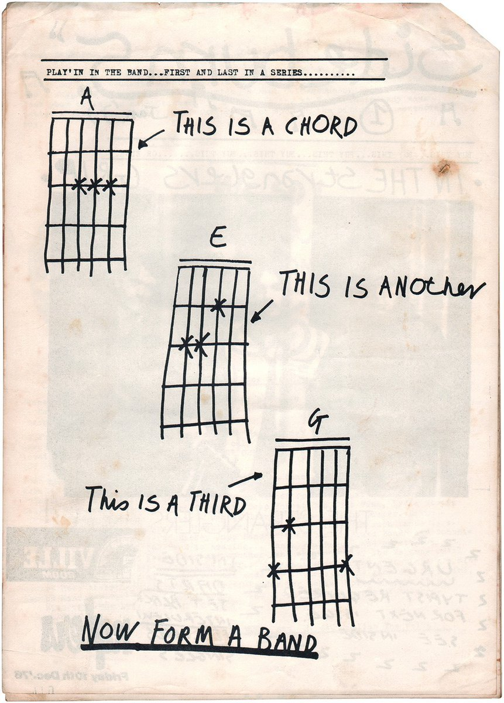
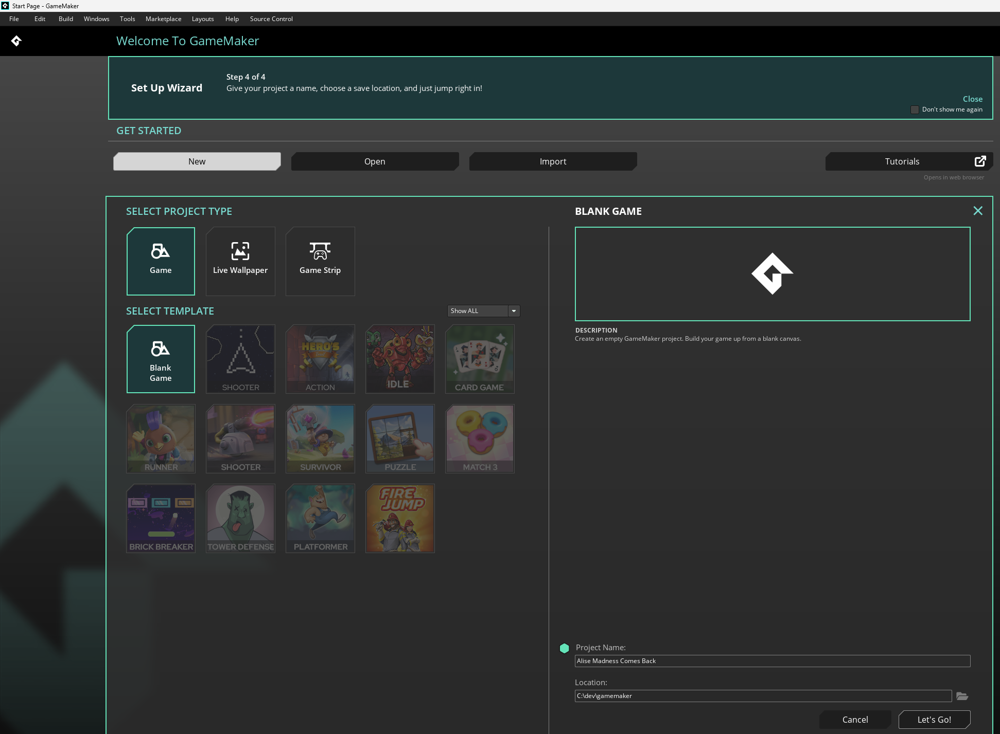
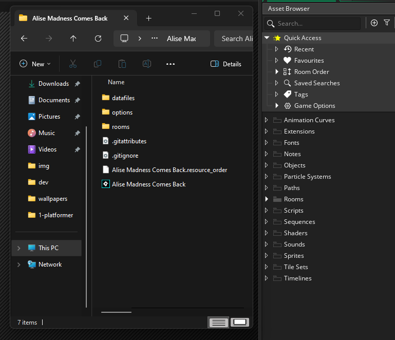
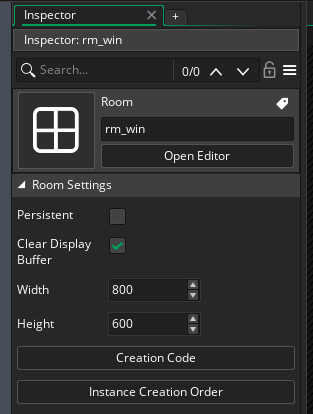
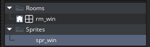
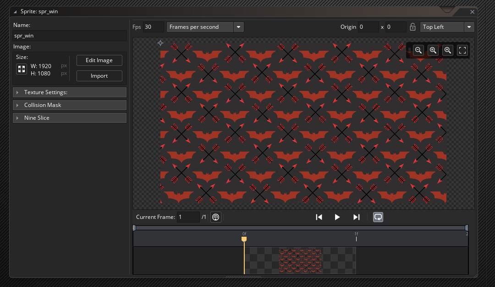
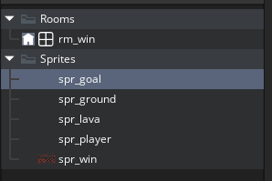
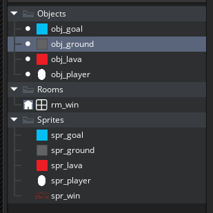
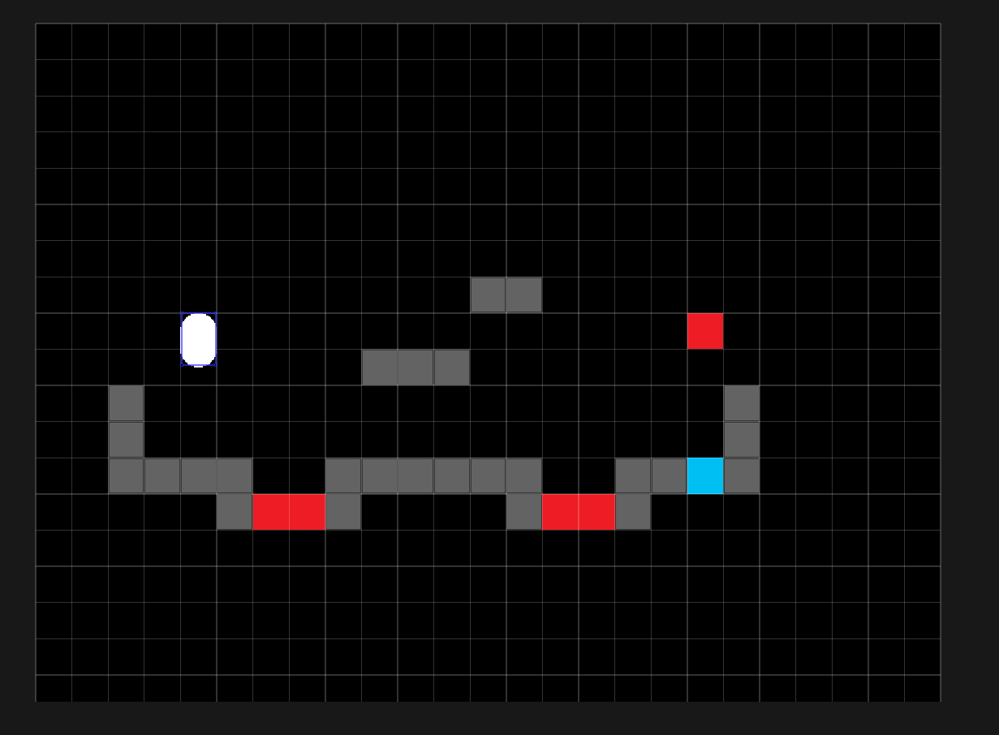
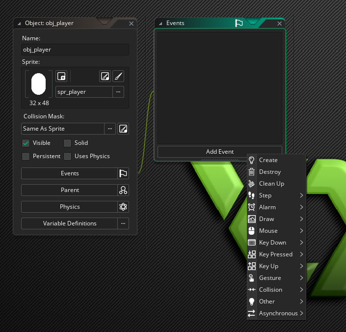

# Get into Gamemaker
Hello and welcome! Normally I do graphics programming work, but I've recently decided to make some Gamemaker tutorials. Gamemaker was my first proper game development experience as a kid. I started using it almost 20 years ago, just after it gained the ability to render 3D graphics. It was also my first experience collaborating with other developers, wild times.

When Gamemaker switched over to Gamemaker Studio there was an adjustment period. Some people loved the new design and others felt it was blindly shoehorning in new features. Coincidentally I stepped away from Gamemaker at the time to focus on getting an adult job, but recently I came back and was pleasantly surprised. But enough preamble, let's get into it!
# Here's three chords, now form a band.
Back when punk exploded in the 1970's, it was agile, scrappy and diy. Tony Moon illustrated in a fanzine to fill an empty page:



This tutorial endeavours to follow in this spirit. We'll be making a simple platformer, writing some code, and that's it. Future tutorials will build on this, but right now we just want to hit the ground running.

# Making a project
Install Gamemaker if you don't already have it. It claims to support windows, mac and ubuntu but good luck getting it working on anything other than windows because it would repeatedly crash on my mac and the resolution was shot.

Make a new blank project, I'm going to call mine "AliseMadnessComesBack".


*Long term viewers of my channel will know of my borderline obsessive enthusiasm for "Alice: Madness Returns"*

Go ahead and make a new project. The default editor has a few panels. To start with, on the right we have the assets panel. It's currently full of folders, which Gamemaker calls "groups". See how only rooms group has anything in it? Compare this with the project files created on our harddrive.



When we make an empty group, Gamemaker reserves a virtual folder within the project, the actual folder is only created when the group has resources in it. Let's expand our rooms group, it has one room. Click on the room, the leftmost panel is populated with some properties. To start, let's rename the room and change its size.



If we play right now, we'll get a blank screen. Let's create a group for sprites, and create a new sprite within it.



See the prefixes here? In Gamemaker there's not a strict separation between rooms and sprites, they're all resources. In order to prevent name clashes it's standard practice to prefix the names with their resource type.

If we double click on the sprite, a floating window appears in the middle panel. To start with we can import the background image from the images folder.



Now we can double click the room to open its editor, and set this sprite as its background.

If we play the game right now we'll see the background. Some of it, at least. This will be the screen the player sees when they win.

# Game Objects
To get some gameplay happening we'll add objects. These will be quite simple, we can always swap them out later. We will create a player, a stone block, a lava block and a goal block.

To start with we'll create sprites to represent them.



The player will be a 32x48 white capsule, and blocks will be 32x32 rectangles of various colors.

With our new sprites made, let's create a group for objects, and make an object for each.



We can now create a new room to represent the game and fill it with our objects.



We'll also need to change the room order so that the game room is our entry point.

# Programming the player
If we play the game right now absolutely nothing happens. We'll need to program some behavior for the player. Let's open up the player object, and add a new event.



We can insert custom code for each of these events. Let's add a create event. Every object already comes with a number of variables, but we're going to define two new ones, movement speed and a flag to indicate whether they're on the ground.

```
movement_speed = [0,0];
on_ground = false;
```

Now let's add some GML code for the step event.

```
// Apply gravity

// Handle keys: left, right, space

// Move

// Handle collisions with lava

// Handle collisions with goal
```

To start with: the keys. Gamemaker can detect whether a key is currently pressed with keyboard_check. Usually GML functions are written in snake case, with the subsystem as the first word. Let's code up the key handling:
```
// Handle keys: left, right, space
if keyboard_check(vk_left) {
	movement_speed[0] -= 1;
}
if keyboard_check(vk_right) {
	movement_speed[0] += 1;
}
if keyboard_check(vk_space) && on_ground {
	movement_speed[1] -= 1;
}
```
Note here that jumping will give us a negative y velocity. This is because in Gamemaker the top of the screen corresponds with y = 0. Now for the movement code:

```
// Move
x += movement_speed[0];
y += movement_speed[1];
```

x and y are predefined variables which every object has. If we play this there are two problems: the player moves through blocks, and the player moves indefinitely. We can fix the infinite movement by resetting the movement speed at the start of each update.
```
// Apply gravity
movement_speed = [0,0];
```

As for collisions, we can check the position in front of us and only move if it's free of ground blocks.

```
test_x = x + movement_speed[0];
if !place_meeting(test_x, y, obj_ground) {
	x = test_x;
}

test_y = y + movement_speed[1];
if !place_meeting(x, test_y, obj_ground) {
	y = test_y;
}
```

Gamemaker's linter is complaining right now. Any variables declared in the create event are scoped to the player object, so test_x and test_y should be declared as local variables, they'll be thrown away when the event ends.

```
var test_x = x + movement_speed[0];
```

Gamemaker is now giving us a less severe warning, named a "Feather Message", it says that we should consider prefixing test_x with an underscore.

```
var _test_x = x + movement_speed[0];
```

Why do this? In GML we can explicitly refer to object variables with the "self" keyword, but to save typing this keyword is understood from the context of the code. One downside is that it then becomes hard to track which variables are scoped to the object and which are temporary, the leading underscore can indicate this.

Now that collision detection is working, we can add gravity.
```
// Apply gravity
var _gravity = 1;
movement_speed = [0, movement_speed[1] + _gravity];
```

And now that the player can fall, we can add code to set their ground status.
```
if keyboard_check(vk_space) && on_ground {
	movement_speed[1] = -1;
	on_ground = false;
}

// ...

var _test_y = y + movement_speed[1];
if !place_meeting(x, _test_y, obj_ground) {
	y = _test_y;
}
else {
	movement_speed[1] = 0;
	on_ground = true;
}
```
It may take a bit of tweaking to get jumping and movement feeling natural.

If you want to make your movement framerate-independant, you can use delta_time. Gamemaker has a global, read only variable named delta_time, it tracks the number of microseconds since the last step event.

```
// Apply gravity
var _gravity = 0.25;
movement_speed = [0, movement_speed[1] + _gravity * 0.0001 * delta_time];

// Handle keys: left, right, space
if keyboard_check(vk_left) {
	movement_speed[0] -= 2;
}
if keyboard_check(vk_right) {
	movement_speed[0] += 2;
}
if keyboard_check(vk_space) && on_ground {
	movement_speed[1] = -6;
	on_ground = false;
}

// Move
var _test_x = x + movement_speed[0] * 0.0001 * delta_time;
if !place_meeting(_test_x, y, obj_ground) {
	x = _test_x;
}

var _test_y = y + movement_speed[1] * 0.0001 * delta_time;
if !place_meeting(x, _test_y, obj_ground) {
	y = _test_y;
}
else {
	movement_speed[1] = 0;
	on_ground = true;
}

// Handle collisions with lava

// Handle collisions with goal
```

Now there are three more cases to handle: falling off the map, touching lava and touching the goal.

```
// Handle collisions with lava
if place_meeting(x, y, obj_lava) || y > 1000 {
	game_restart();
}

// Handle collisions with goal
if place_meeting(x, y, obj_goal) {
	room_goto(rm_win);
}
```

And that's it! There's actually a LOT more to cover, but these are the basics. Now go make games!