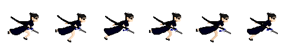
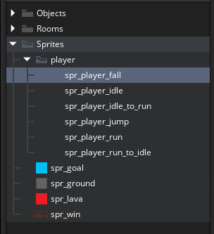
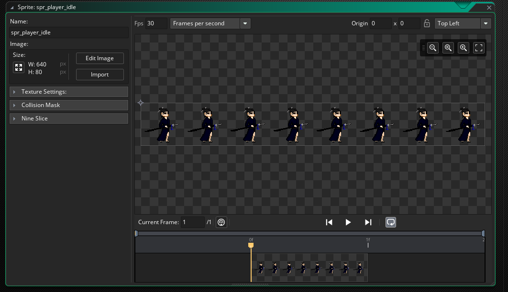
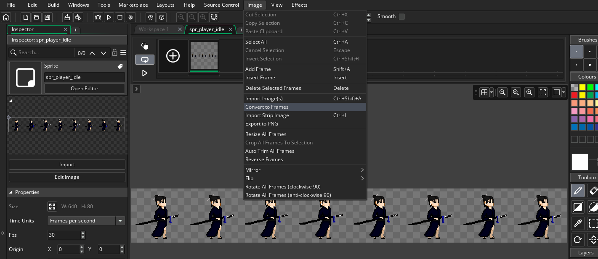
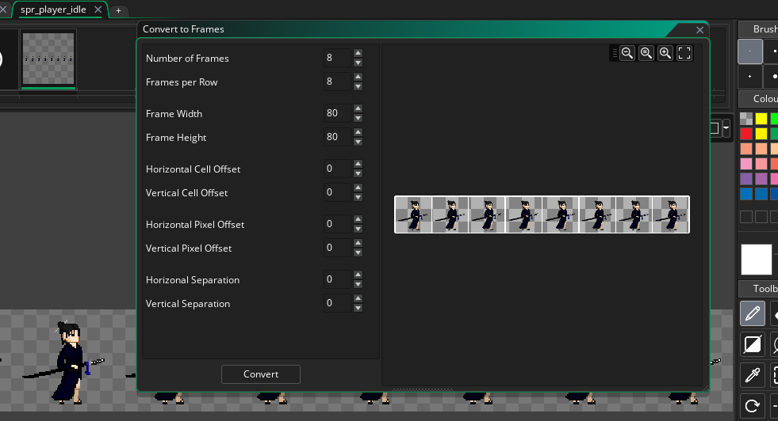
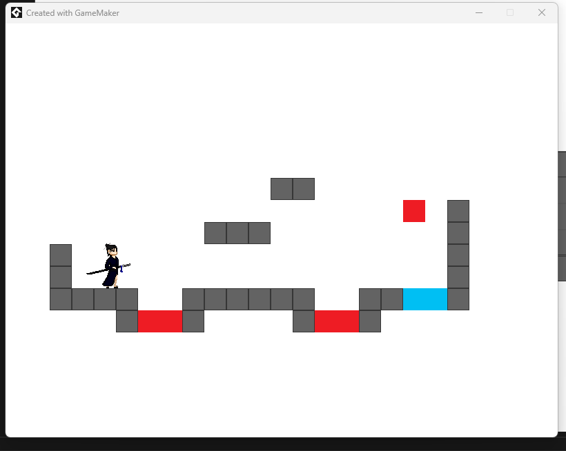
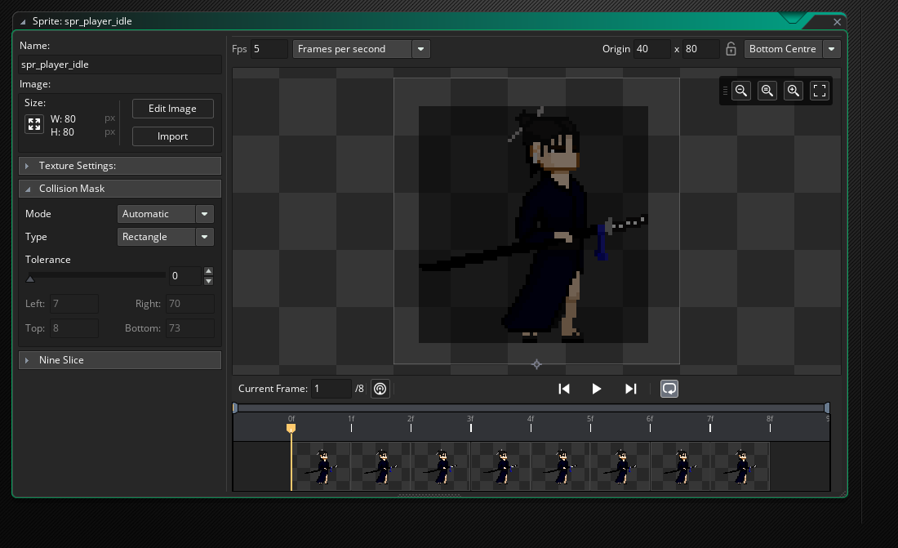
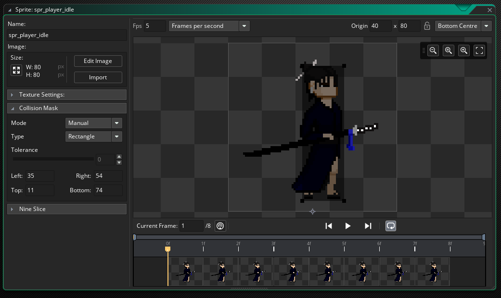

# Get into Gamemaker
Hello and welcome! In this tutorial we're going to use spritesheets to create some animations for our player, and use code to change animations on the fly. Let's get into it!
# Spritesheets
Sprite sheets are basically large images which hold every animation frame for a sprite.



In this tutorial we're going to make five animations for our player:
1. idle
2. transition from idle into running
3. running
4. transition from running back to idle
5. jumping

Each of these are stored in spritesheets in the images folder. To start with let's make a group inside our "Sprites" group and populate it.



Open up the idle sprite and import the appropriate sheet. By default everything comes in as one single frame.



Click edit image, then click "Image > Convert to Frames" on the top ribbon.



This opens up a grid editor. File inspection shows the sheet holds one row of eight images, and has total dimensions of 640x80 pixels, indicating that each image is 80x80 pixels.



Hit convert, and then tweak the framerate until the idle animation looks natural. Then let's go ahead and make all of the other animations.

# Showing an animation
Open the player object and set their sprite to the idle animation. To make the player more visible, change the background color of the room.



Very nice! But there's two problems: the player is idling their way through the whole game, and colisions aren't working properly.

# Transitions
For each animation, there are one or more rules for transitioning in. Let's start with idle to jump and back:

| Entering      | Rule |
| :---        |    :----:   |
| Idle      | landed on ground |
| Idle to Run   | _ |
| Jump   | Not on ground |
| Run   | _ |
| Run to Idle   | _ |

These transitions can be implemented in the player's step code:

```
// ...

if keyboard_check(vk_space) && on_ground {
	movement_speed[1] = -6;
	on_ground = false;
	sprite_index = spr_player_jump;
}

// ...

var _test_y = y + movement_speed[1] * 0.0001 * delta_time;
if !place_meeting(x, _test_y, obj_ground) {
	y = _test_y;
}
else {
	movement_speed[1] = 0;
	if (!on_ground) {
		sprite_index = spr_player_idle;
	}
	on_ground = true;
}

// ...
```

Before we worry about running animations, we need to make sure the player is facing the right direction.

```
if keyboard_check(vk_left) {
	movement_speed[0] -= 2;
	image_xscale = -1;
}
if keyboard_check(vk_right) {
	movement_speed[0] += 2;
	image_xscale = 1;
}
```

Did we just unlock a dash mechanic? Flipping will transform the image around its origin, which was not set correctly. Open up the sprite editor and set its origin to the bottom center.

Now back to the transitions: 

| Entering      | Rule |
| :---        |    :----:   |
| Idle      | landed on ground, or Run to Idle animation ends |
| Idle to Run   | Animation is Idle, and left or right key has just been pressed |
| Jump   | Not on ground |
| Run   | Idle to Run animation has ended |
| Run to Idle   | Running, and either left or right has been released |

The Idle to Run and run to idle cases can be handled in the step code:

```

var _trying_to_run = keyboard_check_pressed(vk_left) 
	|| keyboard_check_pressed(vk_right);
if (sprite_index == spr_player_idle && _trying_to_run) {
	sprite_index = spr_player_idle_to_run;
}

var _not_running = !(keyboard_check(vk_left) || keyboard_check(vk_right));
if (sprite_index == spr_player_run && _not_running) {
	sprite_index = spr_player_run_to_idle;
}

// Move
// ...
```
Now the rest of these are triggered when animations end, add an Animation End event:
```
if (sprite_index == spr_player_idle_to_run) {
	sprite_index = spr_player_run;
}

if (sprite_index == spr_player_run_to_idle) {
	sprite_index = spr_player_idle;
}
```

# Colision Masks
A colision mask is a hit box representing the portion used to hit detection. When we load sprites in, the editor tries its best to automatically detect the hitbox.



Not all of this is necessary for colision detection, we can switch the mode to manual and tweak it.



As always, this might still take some experimentation to look natural. Here's my step code:
```
// Apply gravity
var _gravity = 0.25;
movement_speed = [0, movement_speed[1] + _gravity * 0.0001 * delta_time];

// Handle keys: left, right, space
if keyboard_check(vk_left) {
	movement_speed[0] -= 2;
	image_xscale = -1;
}
if keyboard_check(vk_right) {
	movement_speed[0] += 2;
	image_xscale = 1;
}
if keyboard_check(vk_space) && on_ground {
	movement_speed[1] = -6;
	on_ground = false;
	sprite_index = spr_player_jump;
}

// Status
var _trying_to_run = keyboard_check_pressed(vk_left) 
	|| keyboard_check_pressed(vk_right);
var _not_running = !(keyboard_check(vk_left) || keyboard_check(vk_right));
var _clear_ahead = !place_meeting(x + 16 * sign(movement_speed[0]), y, obj_ground);

if (sprite_index == spr_player_idle && _trying_to_run && _clear_ahead) {
	sprite_index = spr_player_idle_to_run;
}

if (sprite_index == spr_player_run && _not_running) {
	sprite_index = spr_player_run_to_idle;
}
	

// Move
var _test_x = x + movement_speed[0] * 0.0001 * delta_time;
if !place_meeting(_test_x, y, obj_ground) {
	x = _test_x;
}

var _test_y = y + movement_speed[1] * 0.0001 * delta_time;
if !place_meeting(x, _test_y, obj_ground) {
	y = _test_y;
}
else {
	movement_speed[1] = 0;
	if (!on_ground) {
		if (!_not_running) {
			sprite_index = spr_player_idle_to_run;
		}
		else {
			sprite_index = spr_player_idle;
		}
	}
	on_ground = true;
}

// Handle collisions with lava
if place_meeting(x, y, obj_lava) || y > 1000 {
	game_restart();
}

// Handle collisions with goal
if place_meeting(x, y, obj_goal) {
	room_goto(rm_win);
}
```