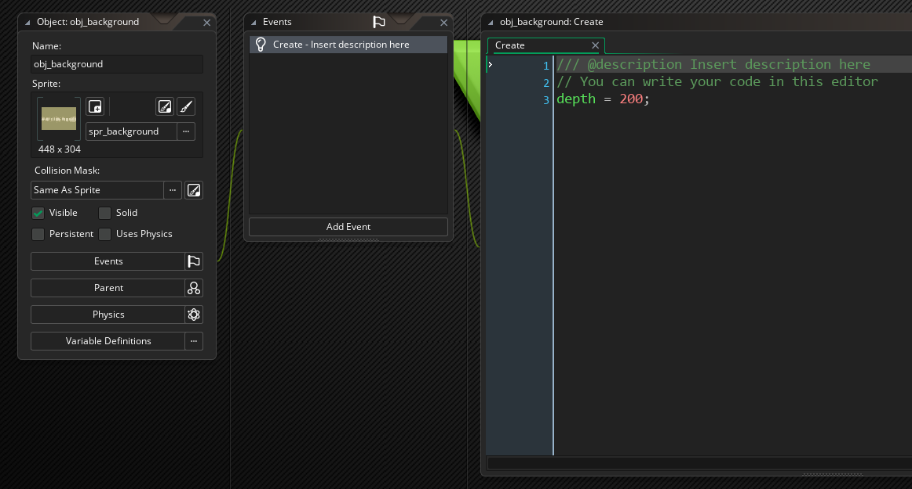
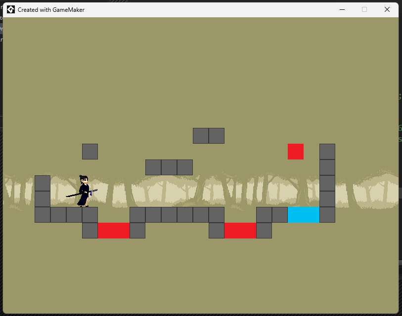
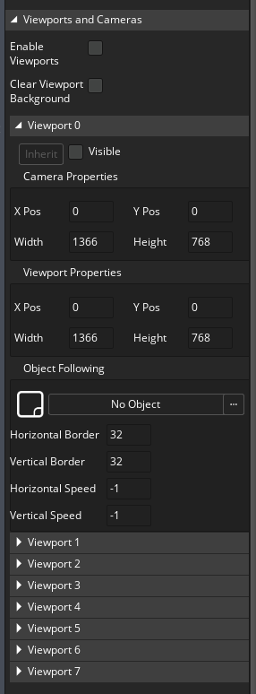
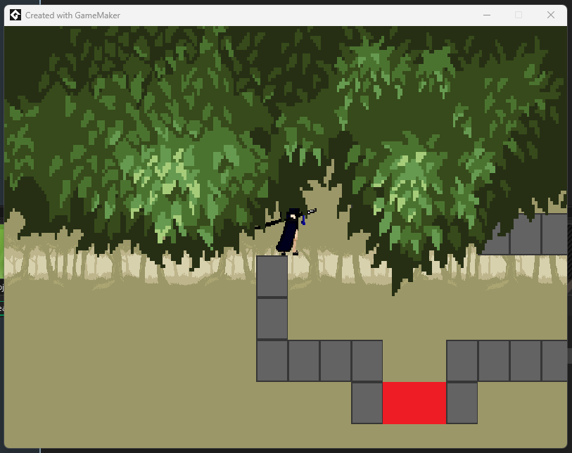

# Get into Gamemaker
Hello and welcome! In this tutorial we're going to show how to improve the realism of our game by adding a 3D camera. If 3D graphics make your life flash before your eyes don't worry. It's actually surprisingly intuitive!
# Drawing with depth
Gamemaker needs some way to resolve draw order of objects. We can try our luck by reordering objects within the room, but that really isn't a robust solution.

To aid with this, every object has a depth variable which can be altered in code. Objects with higher depth will be drawn behind objects with lower depth.

To illustrate this, let's create an object for the game's background.



We can create a lot of these, play and verify that the background is being drawn behind the player.



# Making the Camera
The big reveal here is this: Gamemaker is actually doing everything in 3D already! We have the usual x and y axes, and our third dimension is draw depth. All we need to do is write some code to tell Gamemaker to focus on the player and do some simple 3D perspective.

Open the game room, and in the inspector tab look at the "Viewports and Cameras" section.



Gamemaker has a default view, but it also has a number of camera objects which we can configure. Rather than configuring them in the room editor, let's create a begin draw event for the player and handle everything there.

```
var _camera = view_camera[0];

// Set up camera

camera_apply(_camera);
```

This grabs one of the game's cameras and then sets it up to render the world. By running this code in the Draw Begin event, we're making sure everything is set up properly before anything is drawn. Gamemaker will reset the view to the non-3D default otherwise.

# Perspective projection
Two transformations need to be set up for our camera to work, the first of these is the projection matrix.

```
matrix_build_projection_perspective_fov(
	fov_angle, aspect_ratio, near, far);
```

Let's create a projection with a field of view angle of 90 degrees, drawing objects no nearer than 0.1 and no further than 2000;

```
var _camera = view_camera[0];

var _width = camera_get_view_width(_camera);
var _height = camera_get_view_height(_camera);
var _aspect = _width / _height;

var _projection = matrix_build_projection_perspective_fov(90, _aspect, 0.1, 2000);

camera_set_proj_mat(_camera, _projection);

camera_apply(_camera);
```

# Lookat Transform
If we run this right now it will fail pretty severely, this is because the camera has not been told how to look at the world.

```
matrix_build_lookat(
	from_x, from_y, from_z, 
	to_x, to_y, to_z,
	up_x, up_y, up_z);
```

Let's tell our camera to look at the player's position, from a depth of -160 towards a depth of 0. The up direction must be specified in order to properly orient the camera. Although in our screen coordinates it shoul be (0,-1,0), GPU coordinates are reversed (I know, it's a lot to keep track of).

```
var _camera = view_camera[0];

var _width = camera_get_view_width(_camera);
var _height = camera_get_view_height(_camera);
var _aspect = _width / _height;

var _view = matrix_build_lookat(
	x, y - 20, -160, x, y - 20, 0, 0, 1, 0);
var _projection = matrix_build_projection_perspective_fov(
	90, _aspect, 0.1, 2000);

camera_set_view_mat(_camera, _view);
camera_set_proj_mat(_camera, _projection);

camera_apply(_camera);
```

This sets the camera effect we're after! Just for dramatic effect I went ahead and also made a foreground layer.

